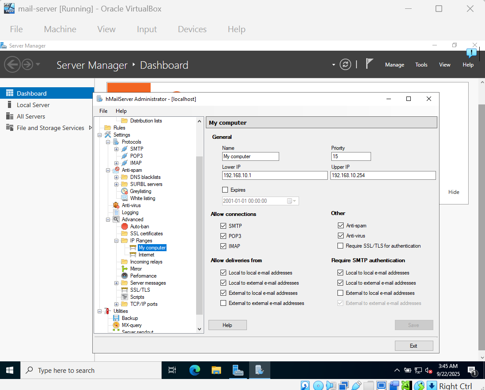
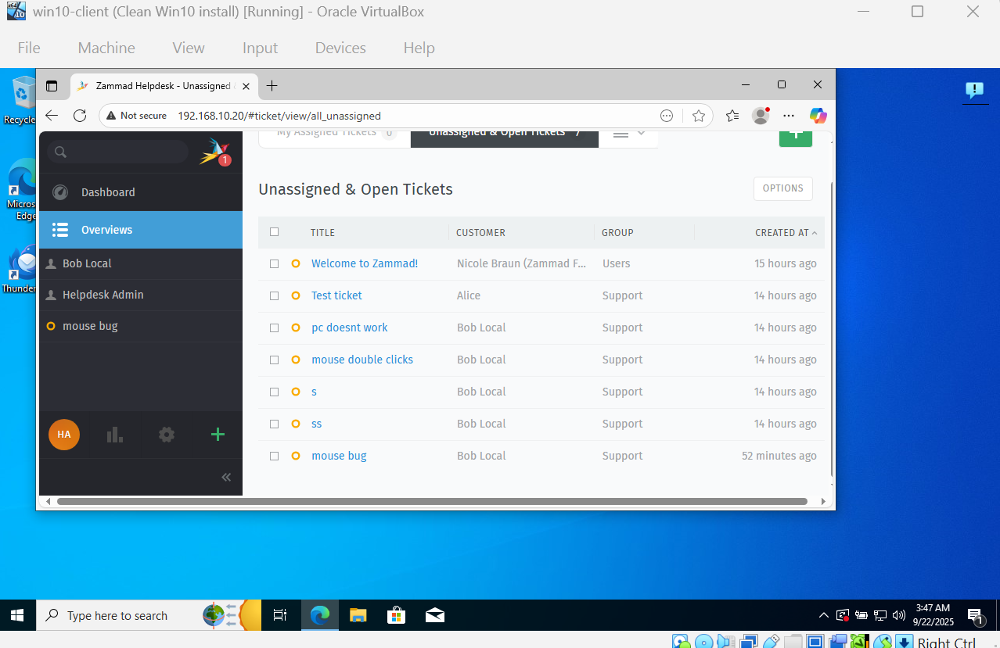
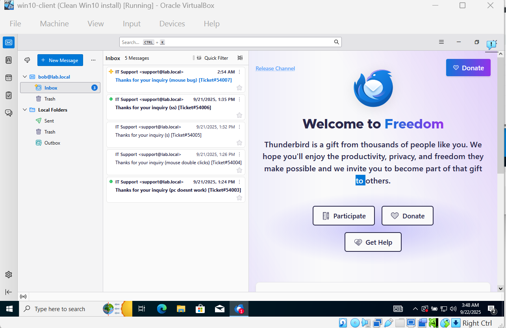
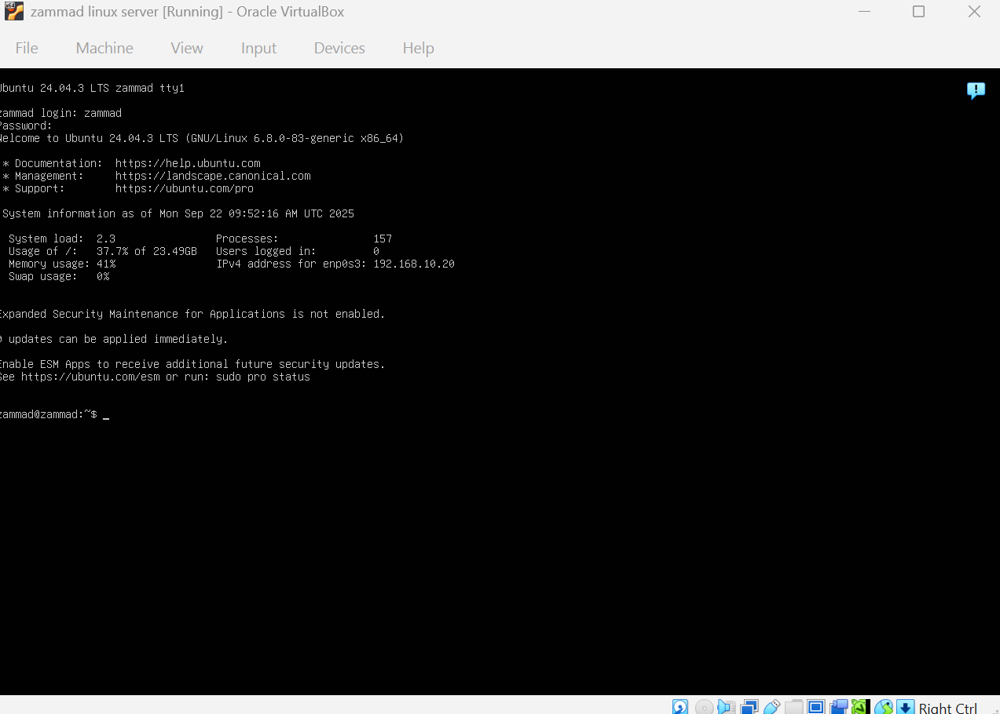

# Project 01 – Mini Helpdesk: Mail + Ticketing (hMailServer + Zammad)

**Goal:**
Provide a simple helpdesk workflow: a domain user emails **[support@lab.local](mailto:support@lab.local)**, Zammad auto-creates a ticket, and IT replies from Zammad back to the user.

**Environment:**

* **DC01** – Windows Server 2022 (AD DS, DNS, DHCP, NAT) – `192.168.10.10`
* **MAIL01** – Windows Server 2022 (hMailServer) – `192.168.10.11`
* **ZAMMAD** – Ubuntu Server 24.04 (Zammad + Nginx) – `192.168.10.20`
* **WIN10** – Windows 10 Pro (Thunderbird client)

**Domain users / mailboxes:** `alice@lab.local`, `bob@lab.local`, `support@lab.local`
**DNS:** DC01 is the resolver for all hosts.

---

## Steps to Reproduce

1. **AD/DNS/DHCP/NAT (DC01)**

* Create users: **Alice**, **Bob**, optional **Helpdesk Admin**.
* Confirm name resolution (A records) for:

  * `mail.lab.local → 192.168.10.11`
  * `zammad.lab.local → 192.168.10.20`

2. **Mail server (MAIL01 – hMailServer)**

* Domain: **lab.local**
* Accounts: **alice**, **bob**, **support**
* Enable **SMTP** and **IMAP**
* **IP Ranges → Internet**

  * *Allow deliveries from*: all four boxes checked
  * *Require SMTP authentication*: check **Local↔Local**, **Local↔External**, **External→Local**
* Windows Firewall: open **TCP 25** (SMTP) and **TCP 143** (IMAP)

3. **Ticketing (ZAMMAD – Ubuntu)**

* Static IP: `192.168.10.20/24`, GW `192.168.10.10`, DNS `192.168.10.10`
* Install Zammad (apt repo or installer)
* In Zammad:

  * **Settings → Channels → Email → Email Notification**

    * Outbound **SMTP** → Host `192.168.10.11`, User `support@lab.local`, Port **25**, **no SSL**
  * **Channels → Email → New**

    * Inbound **IMAP** → Host `192.168.10.11`, User `support@lab.local`, Port **143**, **no SSL**
    * Destination **Group: Support**
  * **Settings → Email → Settings (Notification Sender)**

    * Set to `Zammad Helpdesk <support@lab.local>`
  * Add your agent to the **Support** group.

4. **Client test (WIN10)**

* Thunderbird:

  * IMAP/SMTP server: `mail.lab.local` (or `192.168.10.11`)
  * IMAP **143**, SMTP **25**, **No SSL**, normal password
* From **Bob** → send to **[support@lab.local](mailto:support@lab.local)**
* In Zammad: ticket appears under **Unassigned & Open**
* Reply from Zammad → **Bob** receives the response by email

---

## Result

* Email to **[support@lab.local](mailto:support@lab.local)** creates a ticket in Zammad.
* Agents reply in Zammad; the requester receives the email notification.
* Full internal loop (SMTP/IMAP) works without public internet.

---

## What I Learned

* Minimal on-prem mail + helpdesk workflow using **hMailServer** and **Zammad**
* Mapping outbound/inbound email correctly (SMTP vs IMAP)
* Why SMTP auth + IP Range rules matter (prevents relaying errors)
* Quick DNS strategy in a lab: point everything to the DC for resolution

---

## Quick Troubleshooting

* **“550 Delivery is not allowed to this address.”**
  Zammad is sending as `noreply@…` or without auth. Fix: Outbound SMTP in Zammad must use **[support@lab.local](mailto:support@lab.local)** with password; in hMail **Require SMTP authentication** for Local↔Local and others.

* **“Temporary failure in name resolution.”**
  Zammad DNS isn’t pointing to the DC. Set `/etc/systemd/resolved.conf` or netplan to use **192.168.10.10**, or just use the mail server **IP** in Zammad.

* **No ticket created.**
  Check **Channels → Email → Accounts** shows **IMAP connected**. Ensure IMAP is enabled on hMail and port **143** is open.

* **Thunderbird can’t connect.**
  Match the lab ports (IMAP 143 / SMTP 25, **no SSL**) and **mail.lab.local** (or IP).

---

## Screenshots

---

## Notes

* All services are **persistent**; after a reboot, everything should start automatically (hMailServer, Zammad/Nginx/Postgres/Elasticsearch).
* Keep snapshots/checkpoints before major changes for fast rollback.

---

